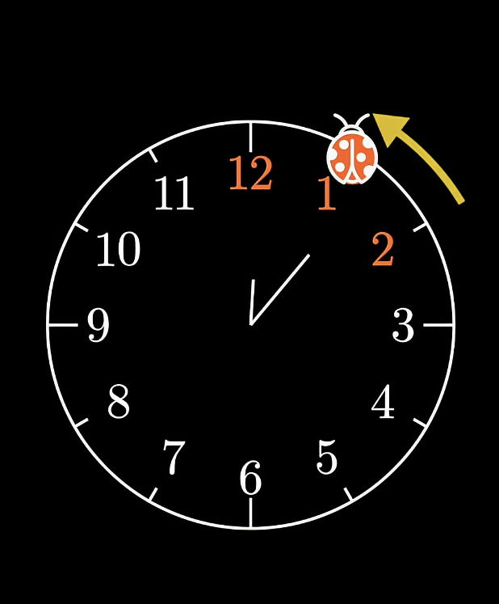
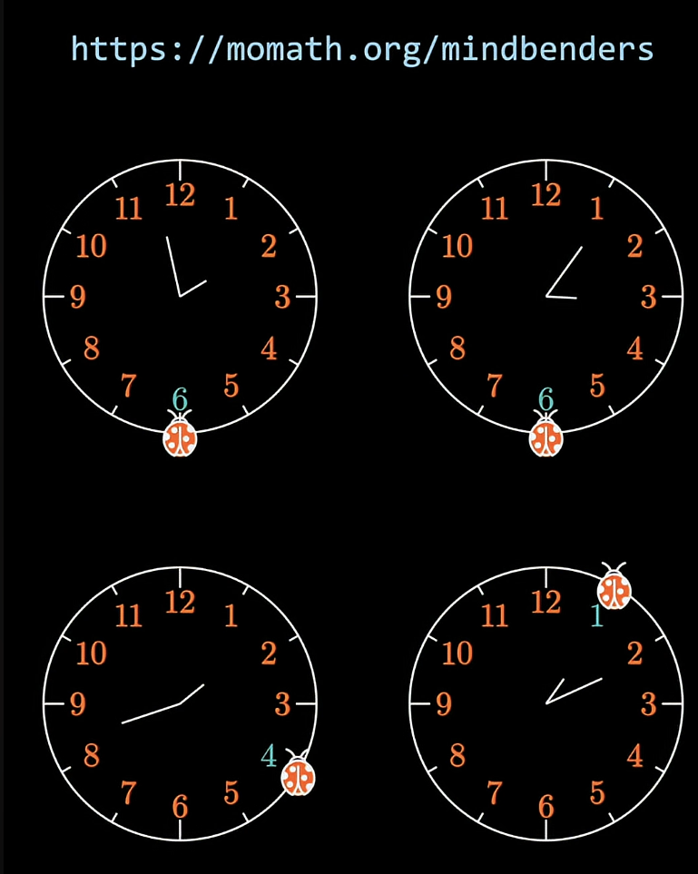

# Where would the ladybug go
Recently the youtuber and mathematics content creator 3Blue1Brown (respect fr 🙏)  shared a puzzle called "[Ladybug Clock puzzle](https://www.youtube.com/shorts/t3jZ2xGOvYg)". The puzzle is pretty straight-forward. 



A ladybug lands on the 12th of a clock and starts to move, and in each move, it'll either move one step clockwise, or one step anti-clockwise until it visits each and every position at least once.

The puzzle was to figure out the probability of the ladybug ending up at 6 as it's last position



<span style="color:red">Don't read ahead if you don't wanna know the answer and want to think this over.</span>

## Answer
It turned out that each last position is equally likely to occur 😀. 
This repo tries to simulate everything and will give out answer in three phases. Each faster or more appealing than the last one.

### Basic simulation
First one is a basic golang simulation and it gave out following result.
```cmd
Starting the simulation. Running for a million iterations.
Number of times ladybug ended up last at 1 is: 91076
Number of times ladybug ended up last at 2 is: 91266
Number of times ladybug ended up last at 3 is: 90734
Number of times ladybug ended up last at 4 is: 91027
Number of times ladybug ended up last at 5 is: 91268
Number of times ladybug ended up last at 6 is: 90259
Number of times ladybug ended up last at 7 is: 90811
Number of times ladybug ended up last at 8 is: 90409
Number of times ladybug ended up last at 9 is: 91220
Number of times ladybug ended up last at 10 is: 91150
Number of times ladybug ended up last at 11 is: 90780
```
As you can see all are pretty similar counts.

Let's add time profiling to our code and see how long it takes to run. Added basic profiling like this
```golang
	start := time.Now()

	lastPosition := make(map[int]int)
	for i := 0; i < MILLION; i++ {
		lastPosition[getLastPosition()]++
	}

	t := time.Now()
	elapsed := t.Sub(start)
```
And here's the result
```
Time taken to run all simulations in series is 1759ms.
```

### Concurrent simulations using workers.
you can find the code in ./concurrent-sim.go. It creates workers depending on how much cores your CPU has and for my M1 macbook air here's how much improvement I got.
```
Time taken to run all simulations in series is 340ms
```
This is around 6X faster.